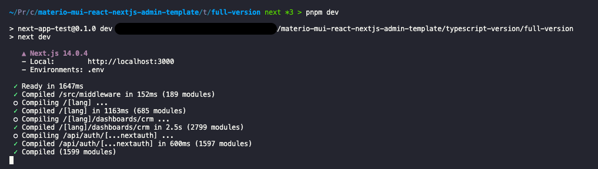

import Tabs from '@theme/Tabs';
import TabItem from '@theme/TabItem';
import CodeBlock from '@theme/CodeBlock';

# Installation

Master is built using [Create Next App](https://nextjs.org/docs/app/api-reference/create-next-app). Create Next App sets up everything automatically for you.

## Guide

First of all make sure you have installed [Node.js](https://nodejs.org/) and [pnpm](https://pnpm.io/) / [yarn](https://yarnpkg.com/) / [npm](https://www.npmjs.com/).

:::tip
pnpm package manager is recommended
:::

:::warning Requirements
Please make sure you use the node's LTS version which is recommended by the official node site and not the one with the latest features or previous versions. Our project is not tested to work with other Node versions.

:::

:::warning important
Before installing the `node_modules`, make sure you have files starting with a dot (`.eslintrc`, `.env.example` etc..). It mostly happens when hidden files are not enabled on your machine and you try to copy our template at some other place on your system.
:::

- After downloading zip, copy this zip to your desired location and then unzip it. Do not unzip first and then copy files to another location, it may not be able to run the template due to missing hidden files not copied over.
- In the uncompressed folder, you will find the `typescript-version` and `javascript-version` folders which contain the `full-version` & `starter-kit` folders. Open the one you want to get started with in your code editor.

To configure your environment variables, follow these steps:

1. Copy the `.env.example` file and rename it to `.env`.
2. Fill in the required values in the `.env` file.
3. Make sure to write your secret in the `NEXTAUTH_SECRET` variable in the `.env` file. You may generate your secret by referring to [this](https://next-auth.js.org/configuration/options#secret) link.
4. If you are using google authentication, make sure to mention your `GOOGLE_CLIENT_ID` and `GOOGLE_CLIENT_SECRET` in the `.env` file.

By following these steps, you can set up and manage your environment variables effectively.

- Run the below command in the console:

  <Tabs
    defaultValue="pnpm"
    values={[
      { label: 'PNPM (Highly Recommended)', value: 'pnpm' },
      { label: 'YARN', value: 'yarn' },
      { label: 'NPM', value: 'npm' },
    ]}>
    <TabItem value="pnpm">
     <CodeBlock language='bash'>pnpm install</CodeBlock>
    </TabItem>
    <TabItem value="yarn">
     <CodeBlock language='bash'>yarn install</CodeBlock>
    </TabItem>
    <TabItem value="npm">
     <CodeBlock language='bash'>npm install</CodeBlock>
    </TabItem>
  </Tabs>

- After installing the modules run your project with following command:

  <Tabs
    defaultValue="pnpm"
    values={[
      { label: 'PNPM (Highly Recommended)', value: 'pnpm' },
      { label: 'YARN', value: 'yarn' },
      { label: 'NPM', value: 'npm' },
    ]}>
    <TabItem value="pnpm">
      <CodeBlock language='bash'>pnpm dev</CodeBlock>
    </TabItem>
    <TabItem value="yarn">
      <CodeBlock language='bash'>yarn dev</CodeBlock>
    </TabItem>
    <TabItem value="npm">
      <CodeBlock language='bash'>npm dev</CodeBlock>
    </TabItem>
  </Tabs>

- You will find following output after running above command in console:
  {/*  */}
  

- Congratulations! You have successfully run the project. Visit [http://localhost:3000/](http://localhost:3000/) to check it in your browser.

:::note
Your network URL might not have same URL as screenshot and that is completely fine. It depends on your network.
:::